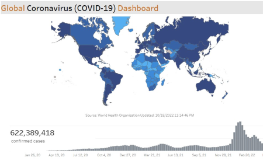
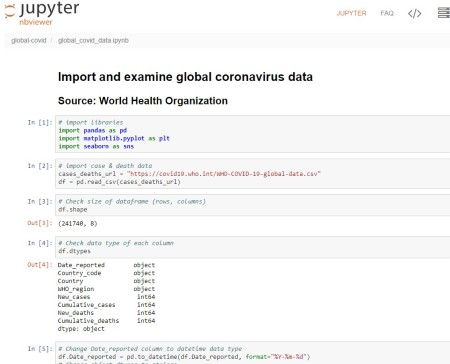

# Project: Analyzing Global Coronavirus Data
- **Software:** Python, Jupyter Notebook, python libraries (pandas, matplotlib, seaborn), Tableau
- **Data:** World Health Organization

**Overview:** Utilizing python in a Jupyter environment, download data via web url. Inspect the data, and complete some preliminary visualizations. Download the resulting dataframe to a csv file.
Establish a data connection to the cleaned file with Tableau and perform an analysis of the data. Create visualizations and a dashboard. To view  the completed dashboard, CTRL + click here: 

### [Tableau dashboard](https://public.tableau.com/app/profile/john.gimlin/viz/GlobalCOVID-19_16656850454070/Dashboard)

CTRL + click below to view the python code:
### [nbviewer notebook](https://nbviewer.org/github/jdgimlin/global-covid/blob/main/global_covid_data.ipynb)

